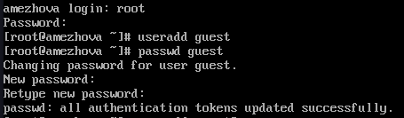
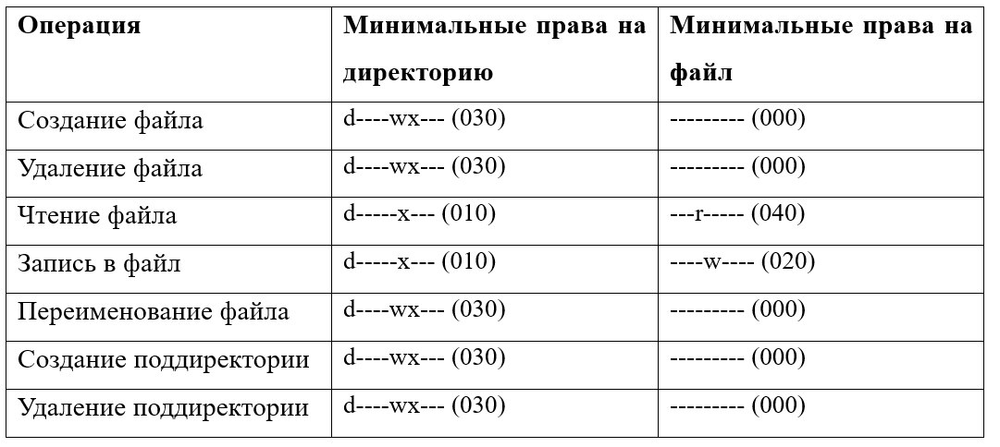

---
## Front matter
lang: ru-RU
title: Лабораторная работа №3
subtitle: Дискреционное разграничение прав в Linux. Два пользователя
author:
  - Ежова А. М.
institute:
  - Российский университет дружбы народов, Москва, Россия
  - Факультет физико-математических и естесвенных наук
date: 12 марта 2024

## i18n babel
babel-lang: russian
babel-otherlangs: english

## Formatting pdf
toc: false
toc-title: Содержание
slide_level: 2
aspectratio: 169
section-titles: true
theme: metropolis
header-includes:
 - \metroset{progressbar=frametitle,sectionpage=progressbar,numbering=fraction}
 - '\makeatletter'
 - '\beamer@ignorenonframefalse'
 - '\makeatother'
---

# Информация

## Докладчик

:::::::::::::: {.columns align=center}
::: {.column width="70%"}

  * Ежова Алиса Михайловна
  * студентка НБИбд-02-22
  * Российский университет дружбы народов
  * <https://github.com/AlisaEzhova>

:::
::: {.column width="30%"}


:::
::::::::::::::

# Вводная часть

## Актуальность

- Данная работа актуальна для студентов, которые хотят освоить умения по работе с виртуальной машиной.

## Цели и задачи

- Получение практических навыков работы в консоли с атрибутами файлов для групп пользователей.

## Материалы и методы

- Процессор `pandoc` для входного формата Markdown
- Результирующие форматы
	- `pdf`
	- `html`
- Автоматизация процесса создания: `Makefile`

# Создание презентации

## Процессор `pandoc`

- Pandoc: преобразователь текстовых файлов
- Сайт: <https://pandoc.org/>
- Репозиторий: <https://github.com/jgm/pandoc>

## Формат `pdf`

- Использование LaTeX
- Пакет для презентации: [beamer](https://ctan.org/pkg/beamer)
- Тема оформления: `metropolis`

## Код для формата `pdf`

```yaml
slide_level: 2
aspectratio: 169
section-titles: true
theme: metropolis
```

## Формат `html`

- Используется фреймворк [reveal.js](https://revealjs.com/)
- Используется [тема](https://revealjs.com/themes/) `beige`

## Код для формата `html`

- Тема задаётся в файле `Makefile`

```make
REVEALJS_THEME = beige 
```
# Результаты

## Получающиеся форматы

- Полученный `pdf`-файл можно демонстрировать в любой программе просмотра `pdf`
- Полученный `html`-файл содержит в себе все ресурсы: изображения, css, скрипты

## Содержание исследования

1. В установленной операционной системе создала учётную запись пользователя guest (используя учётную запись администратора) и задала пароль для пользователя guest (используя учётную запись администратора):

{#fig:001 width=90%}

##

2. Аналогично создала второго пользователя guest2:

{#fig:002 width=90%}

##

3. Добавила пользователя guest2 в группу guest:

{#fig:003 width=90%}
##

{#fig:006 width=90%}

##

4. Осуществила вход в систему от двух пользователей на двух разных консолях: guest на первой консоли и guest2 на второй консоли:

{#fig:004 width=90%}

##

{#fig:005 width=90%}

5. Уточнила имя моего пользователя, его группу, кто входит в неё и к каким группам принадлежит он сам. Определила командами groups guest и groups guest2, в какие группы входят пользователи guest и guest2. Сравнила вывод команды groups с выводом команд id -Gn и id -G.:

{#fig:006 width=90%}

##

{#fig:007 width=90%}

6. Сравнила полученную информацию с содержимым файла /etc/group.
Просмотрела файл командой cat /etc/group:

{#fig:008 width=90%}

##

{#fig:009 width=90%}

##

7.  От имени пользователя guest2 выполните регистрацию пользователя guest2 в группе guest командой newgrp guest:

{#fig:010 width=90%}

##

8. От имени пользователя guest изменила права директории /home/guest, разрешив все действия для пользователей группы:
chmod g+rwx /home/guest
От имени пользователя guest снимите с директории /home/guest/dir1 все атрибуты командой chmod 000 dirl:

{#fig:011 width=90%}

9. Заполнение и сравнение таблиц:

{#fig:012 width=90%}

##

{#fig:013 width=90%}

##

{#fig:014 width=90%}

##

{#fig:015 width=90%}

##

{#fig:016 width=90%}

##

{#fig:017 width=90%}

##

{#fig:018 width=90%}

## Результаты

- Научились работать с виртуальной машиной.

## Итоговый слайд

В процессе выполнения лабораторной работы №3 я получила практические навыки работы в консоли с атрибутами файлов для групп пользователей.
