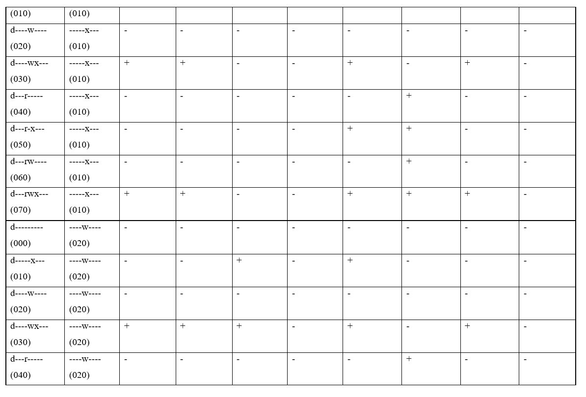
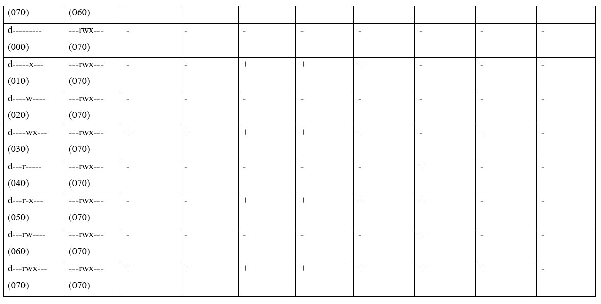

---
## Front matter
title: "Лабораторная работа №3"
subtitle: "Основы информационной безопасности"
author: "Ежова Алиса Михайловна"

## Generic otions
lang: ru-RU
toc-title: "Содержание"

## Bibliography
bibliography: bib/cite.bib
csl: pandoc/csl/gost-r-7-0-5-2008-numeric.csl

## Pdf output format
toc: true # Table of contents
toc-depth: 2
lof: true # List of figures
fontsize: 12pt
linestretch: 1.5
papersize: a4
documentclass: scrreprt
## I18n polyglossia
polyglossia-lang:
  name: russian
  options:
	- spelling=modern
	- babelshorthands=true
polyglossia-otherlangs:
  name: english
## I18n babel
babel-lang: russian
babel-otherlangs: english
## Fonts
mainfont: PT Serif
romanfont: PT Serif
sansfont: PT Sans
monofont: PT Mono
mainfontoptions: Ligatures=TeX
romanfontoptions: Ligatures=TeX
sansfontoptions: Ligatures=TeX,Scale=MatchLowercase
monofontoptions: Scale=MatchLowercase,Scale=0.9
## Biblatex
biblatex: true
biblio-style: "gost-numeric"
biblatexoptions:
  - parentracker=true
  - backend=biber
  - hyperref=auto
  - language=auto
  - autolang=other*
  - citestyle=gost-numeric
## Pandoc-crossref LaTeX customization
figureTitle: "Рис."
tableTitle: "Таблица"
listingTitle: "Листинг"
lofTitle: "Список иллюстраций"
lotTitle: "Список таблиц"
lolTitle: "Листинги"
## Misc options
indent: true
header-includes:
  - \usepackage{indentfirst}
  - \usepackage{float} # keep figures where there are in the text
  - \floatplacement{figure}{H} # keep figures where there are in the text
---

# Цель работы

Получение практических навыков работы в консоли с атрибутами файлов для групп пользователей.

# Выполнение лабораторной работы

1) В установленной операционной системе создала учётную запись пользователя guest (используя учётную запись администратора) и задала пароль для пользователя guest (используя учётную запись администратора):

{#fig:001 width=90%}

2) Аналогично создала второго пользователя guest2:

{#fig:002 width=90%}

3) Добавила пользователя guest2 в группу guest:

{#fig:003 width=90%}

4) Осуществила вход в систему от двух пользователей на двух разных консолях: guest на первой консоли и guest2 на второй консоли:

{#fig:004 width=90%}

{#fig:005 width=90%}

5) Уточнила имя моего пользователя, его группу, кто входит в неё и к каким группам принадлежит он сам. Определила командами groups guest и groups guest2, в какие группы входят пользователи guest и guest2. Сравнила вывод команды groups с выводом команд id -Gn и id -G.:

{#fig:006 width=90%}

{#fig:007 width=90%}

6) Сравнила полученную информацию с содержимым файла /etc/group.
Просмотрела файл командой cat /etc/group:

{#fig:008 width=90%}

{#fig:009 width=90%}

7) От имени пользователя guest2 выполните регистрацию пользователя guest2 в группе guest командой newgrp guest:

{#fig:010 width=90%}

8) От имени пользователя guest изменила права директории /home/guest, разрешив все действия для пользователей группы:
chmod g+rwx /home/guest
От имени пользователя guest снимите с директории /home/guest/dir1 все атрибуты командой chmod 000 dirl:

{#fig:011 width=90%}

9) Заполнение и сравнение таблиц:

{#fig:012 width=90%}

{#fig:013 width=90%}

{#fig:014 width=90%}

{#fig:015 width=90%}

{#fig:016 width=90%}

{#fig:017 width=90%}

{#fig:018 width=90%}

# Выводы

В процессе выполнения лабораторной работы №3 я получила практические навыки работы в консоли с атрибутами файлов для групп пользователей.
